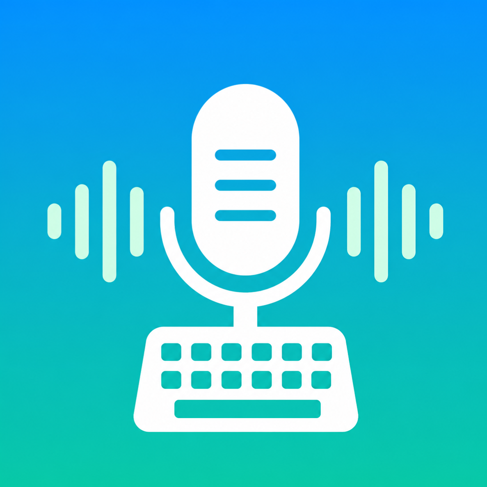
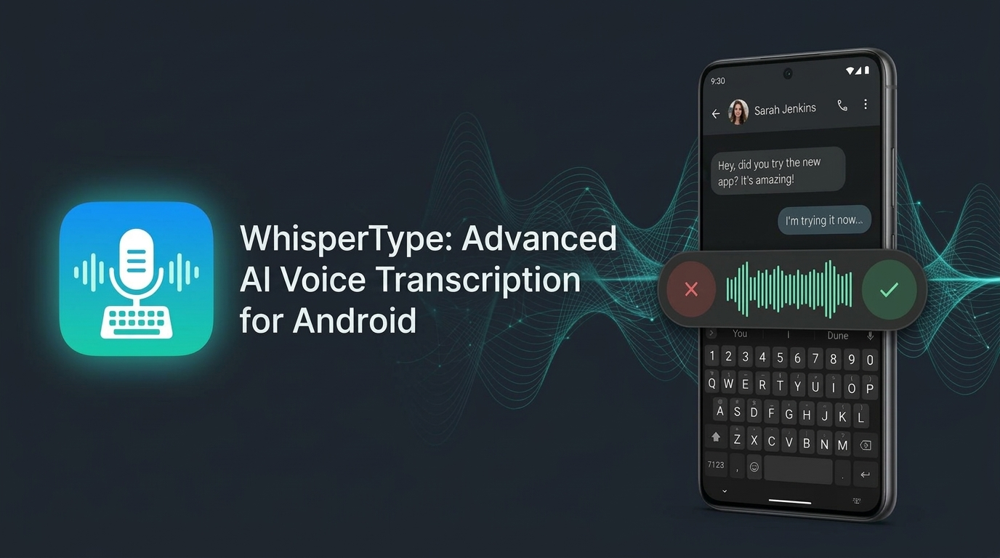
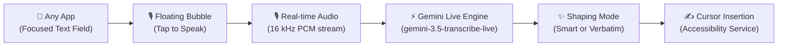
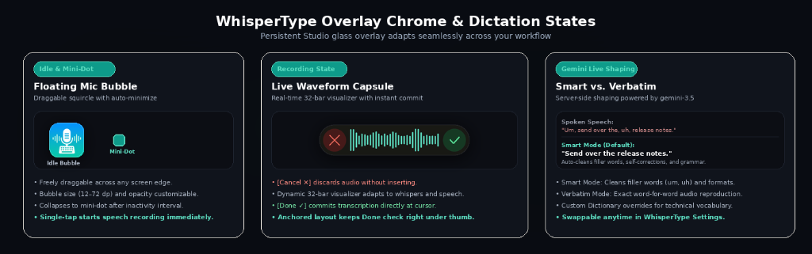
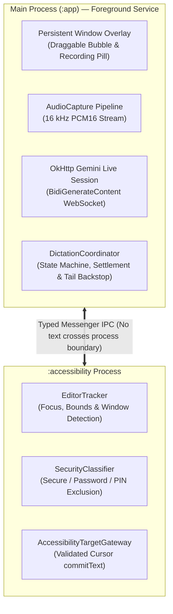

<p align="center">
  
</p>

<h1 align="center">WhisperType</h1>

<p align="center">
  <b>Effortless, System-Wide AI Voice Typing for Android</b><br>
  <i>Real-time speech-to-text powered directly by Google Gemini Live</i>
</p>

<p align="center">
  <a href="https://github.com/chaosmanage/WhisperType-Android/releases/latest"></a>
  
  
  
  
</p>

<p align="center">
  <a href="https://github.com/chaosmanage/WhisperType-Android/releases/latest/download/app-release.apk">
    
  </a>
</p>

<p align="center">
  
</p>

---

Speak naturally, type instantly in any app—while keeping your favorite keyboard. WhisperType floats an elegant, draggable microphone bubble above any text field—in Messages, WhatsApp, Gmail, Slack, Notes, browser, or any Android app—and streams your voice directly to Google's Gemini Live API for instant, beautifully shaped cursor insertion.

> **Direct-to-API Architecture:** WhisperType operates with **no intermediary servers, no accounts, and no telemetry**. Your Gemini API key and dictation history are encrypted on-device with Android Keystore AES-GCM-256. Audio streams directly from your phone to Google's official Gemini Live endpoint over TLS using your own API key. See [Privacy, Security & Data Handling](#-privacy-security--data-handling) for Google API retention and training terms.

---

## ⚡ How It Works



1. **Focus any text field** — the floating WhisperType bubble appears above your keyboard.
2. **Tap the bubble (or mini-dot)** — speak naturally as the real-time waveform displays your voice activity.
3. **Finish speaking** — tap Done `✓` (or pause for auto-stop); your shaped transcription is committed directly at the cursor.

---

## 🌟 Highlights

<p align="center">
  
</p>

### 🎯 Floating Mic Bubble & Mini-Dot
- Freely draggable squircle bubble floats above your keyboard on any app.
- Auto-minimizes to an unobtrusive mini-dot after inactivity (configurable delay).
- Bubble size (12–72 dp) and opacity are fully customizable in Settings.

### 🌊 Recording Capsule & Live Waveform
- An elegant floating pill displays **[Cancel ✕] [Real-Time Waveform] [Done ✓]**.
- Visual audio feedback is responsive and dynamic, adapting to both soft whispers and normal speaking levels.
- Anchored layout ensures the Done checkmark lands right where you tapped to start.

### 🧠 Smart vs. Verbatim Transcription
Choose between two distinct transcription shaping modes:

| Mode | Shaping & Output | Best For |
| :--- | :--- | :--- |
| **Smart** *(Default)* | Server-side shaping: eliminates filler words (*"um"*, *"uh"*), resolves self-corrections, and formats grammar, punctuation, and casing. | Everyday messaging, emails, notes, drafting |
| **Verbatim** | Word-for-word literal transcription preserving all spoken repetitions, filler words, and pauses. | Exact quotes, transcription verification, dictation tests |

### 🔄 In-App & OTA GitHub Updates
- Automatically queries public GitHub releases on app startup.
- Displays an update banner on the Home tab and posts an Android notification when a new version is published.
- Tapping triggers automatic APK download in your default browser.

### 🎧 Bluetooth Headset & Hardware Hotkey Support
- Switch recording source to a connected Bluetooth headset microphone.
- Map a physical keyboard key (e.g. grave/backtick `` ` ``) to start and complete dictations hands-free on physical keyboards or tablets (Samsung DeX supported).

### 📖 Custom Dictionary
- Define custom pronunciation and replacement rules (e.g., spoken technical terms, slang, or names) that automatically substitute on text insertion.

### 🔒 Encrypted History
- Review past dictation history with word counts and timestamps.
- Encrypted locally with Android Keystore AES-GCM; configurable auto-retention (7, 14, 30, or 90 days).

---

## 🏗️ Architecture

WhisperType runs across two isolated processes for security, stability, and speed:



- **Main Process** (`platform/runtime/FlowRuntimeService.kt`): Owns the foreground service, the overlay composition, mic capture, and the Gemini Live WebSocket session.
- **Accessibility Process** (`platform/accessibility/WhisperTypeAccessibilityService.kt`): Tracks cursor focus, guarantees secure field exclusion (passwords/PINs never show the bubble), and inserts validated text.

---

## 🚀 Quick Start

1. **Install the App**:
   Download the latest signed release APK from [GitHub Releases](https://github.com/chaosmanage/WhisperType-Android/releases/latest) and install it on your device.
2. **Grant Permissions**:
   Allow **Overlay**, **Microphone**, and optional **Notification** permissions when prompted.
3. **Enable Accessibility Service**:
   Navigate to **Android Settings → Accessibility → WhisperType** and toggle it **ON**.
4. **Configure Gemini API Key**:
   Open WhisperType → **Settings → Gemini account** → paste your Google Gemini API key. The key is encrypted in your device's Keystore.
5. **Start Dictating**:
   Open any app (Messages, Notes, Slack, etc.), focus a text field, tap the floating bubble, and speak!

---

## 🛡️ Privacy, Security & Data Handling

### What WhisperType Does
- **Zero Intermediary Servers**: There are no WhisperType backend servers, user accounts, telemetry, or tracking.
- **Encrypted Secrets**: Your Gemini API key is encrypted using hardware-backed Android Keystore with AES-GCM-256 in app-private, no-backup storage. It is never logged or exposed.
- **No Disk Storage for Audio**: Audio streams live in memory and is never saved to disk or logged.
- **Password & PIN Exclusion**: Password fields, PIN fields, and `FLAG_SECURE` screens are explicitly blocked. The bubble never displays over sensitive fields.
- **Microphone Discipline**: The microphone captures audio only while you are actively dictating; continuous background recording is not supported.

### How Google Handles Your Data
WhisperType connects directly to Google's Gemini Live API using your personal API key. Data handling and retention are governed by [Google's Gemini API Terms of Service](https://ai.google.dev/gemini-api/terms):
- **Free Tier (No Billing Account)**: Under Google's terms for unpaid services, prompts, audio, and responses may be retained and used to train and improve Google's machine learning models, and may be subject to human review (except where prohibited, such as in the EEA, UK, and Switzerland).
- **Paid Tier (Active Billing Account)**: Under Google's Paid Services terms, Google **does not** use your prompts, audio, or responses to train Google models.
- **Recommendation for Privacy**: To ensure your voice dictations are not used for model training, attach an active billing account to your Google Cloud / Google AI Studio project (pay-as-you-go).

---

## 📚 Documentation Hub

| Guide | Description |
| :--- | :--- |
| [`docs/USER_SETUP.md`](docs/USER_SETUP.md) | Comprehensive step-by-step setup guide and onboarding walkthrough |
| [`docs/ARCHITECTURE.md`](docs/ARCHITECTURE.md) | Two-process architecture, IPC contracts, and module breakdown |
| [`docs/GEMINI_LIVE.md`](docs/GEMINI_LIVE.md) | Gemini Live protocol mechanics, settlement, and wire reference |
| [`docs/RELEASE_PROCESS.md`](docs/RELEASE_PROCESS.md) | Versioning, signing, and GitHub release deployment protocol |
| [`docs/SECURITY_AND_PRIVACY.md`](docs/SECURITY_AND_PRIVACY.md) | Threat model, Keystore encryption, and privacy rules |
| [`docs/TESTING.md`](docs/TESTING.md) | Test suite breakdown, device matrix, and manual acceptance testing |
| [`docs/TROUBLESHOOTING.md`](docs/TROUBLESHOOTING.md) | Diagnosing common overlay, accessibility, or network issues |
| [`docs/CONTRIBUTING.md`](docs/CONTRIBUTING.md) | Developer workflow, code standards, and PR requirements |
| [`docs/PUSH_TO_PHONE_VIA_ADB.md`](docs/PUSH_TO_PHONE_VIA_ADB.md) | Wireless ADB deployment over Tailscale |
| [`CHANGELOG.md`](CHANGELOG.md) | Full version release history |

---

## 🛠️ Build & Development

Requires JDK 17 and Android SDK Platform 36.

```bash
# Run JVM unit tests
./gradlew :app:testDebugUnitTest

# Run code analysis (warnings are errors)
./gradlew :app:lintDebug

# Assemble debug APK
./gradlew :app:assembleDebug

# Assemble signed release APK
./gradlew :app:assembleRelease
```

---

## 📱 Supported Environment & Requirements

- **Operating System**: Android 13+ (`minSdk 33`, `targetSdk 36`).
- **Supported Keyboards**: Gboard, Samsung Keyboard, Microsoft SwiftKey (standard docked mode).
- **Service Requirements**: Android Accessibility Service enabled; overlay permission granted.
- **Current Release**: **v1.2.8** (`versionCode = 74`).
