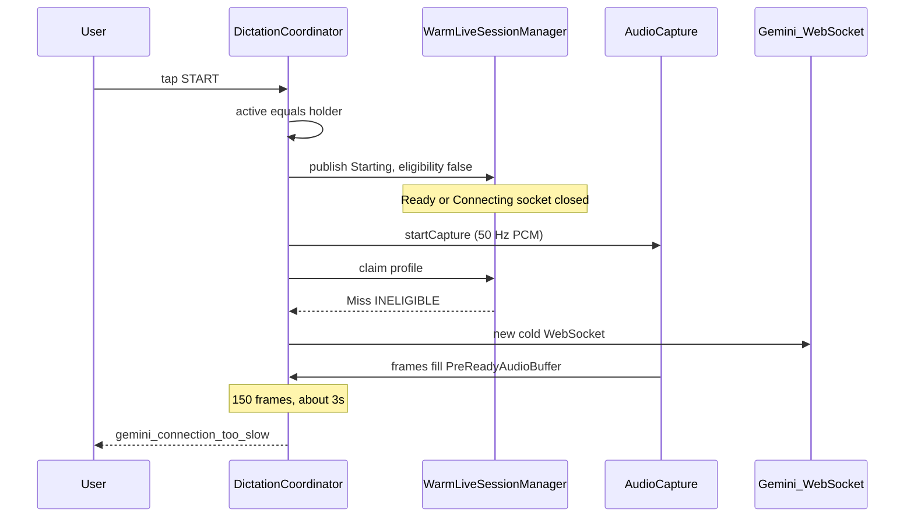

# Fix Gemini connection-too-slow

> Status: **implemented in 1.0.8.** This document is the diagnosis record and
> the plan that shipped in that release.

---

## What the toast actually is

The screenshot is [`DictationFailure`](../app/src/main/java/com/whispertype/android/platform/runtime/DictationCoordinator.kt) code `gemini_connection_too_slow`:

```1157:1162:app/src/main/java/com/whispertype/android/platform/runtime/DictationCoordinator.kt
    /** F5: the pre-ready buffer overflowed, so the connection was too slow. */
    private fun connectionTooSlow(): DictationFailure = DictationFailure(
        code = "gemini_connection_too_slow",
        message = "The Gemini connection is too slow. Try again.",
```

It is **not** the 15s `awaitReady` timeout (`gemini_setup`) and **not** a transport drop (`gemini_transport`). It fires when [`PreReadyAudioBuffer`](../app/src/main/java/com/whispertype/android/audio/PreReadyAudioBuffer.kt) hits **150 frames × 20 ms ≈ 3.0 s** of mic audio while the Live session is still waiting for `setupComplete`. Overflow is never dropped (Release F5); the session fails immediately.



The 15s ready timeout in [`OkHttpGeminiLiveSession`](../app/src/main/java/com/whispertype/android/platform/gemini/OkHttpGeminiLiveSession.kt) never gets a chance. A handshake that would succeed at 3.2–8 s is reported as “too slow.” Retry shows the same toast because Retry is another cold connect.

---

## Root cause 1 (primary): warm pool is killed before claim

This is why the app is **completely unusable**, not just slow on a bad network.

Tap path in [`DictationCoordinator.start()`](../app/src/main/java/com/whispertype/android/platform/runtime/DictationCoordinator.kt):

1. `active = holder` → `isActive` becomes true
2. `publish(Starting)` → [`FlowRuntimeService.publish`](../app/src/main/java/com/whispertype/android/platform/runtime/FlowRuntimeService.kt) → `refreshWarmEligibility()`
3. [`computeWarmEligibility()`](../app/src/main/java/com/whispertype/android/platform/runtime/FlowRuntimeService.kt) requires `!coordinator.isActive` → **false**
4. [`WarmLiveSessionManager.onEligibilityChanged(false)`](../app/src/main/java/com/whispertype/android/platform/gemini/WarmLiveSessionManager.kt) cancels the pool job and **closes** any manager-owned Ready/Connecting socket
5. Only later does `runSession` call `resolveSession()` → `warmManager.claim(profile)`
6. `takeReady` returns immediately on `!eligible` → `WarmSessionClaimMissReason.INELIGIBLE`

A Ready warm session is therefore **never claimable on the tap path**. Prewarm work (TLS + `setup` + `setupComplete`) is thrown away on every tap, then a brand-new cold socket is opened.

Retry makes it worse: `fail()` leaves `active` set while `Error` is on screen (`retryAllowed`), so eligibility stays false and the pool never rebuilds. Retry is always cold.

---

## Root cause 2: 3s overflow vs 15s ready timeout

Even a healthy cold connect is racing a hair-trigger:

| Clock | Budget | What it measures |
| --- | --- | --- |
| `PreReadyAudioBuffer` | **150 frames ≈ 3 s** | Mic frames while `awaitReady()` pending |
| `awaitReady` | **15 s** | Time to `setupComplete` |
| Capture channel | **64 frames ≈ 1.28 s** | Frames queued *before* `streamAudio` starts |

`runSession` is sequential today: `startCapture()` **then** `resolveSession()` **then** launch `streamAudio` / `awaitReadyAndStart`. The WebSocket is constructed only at the end of `resolveSession` ([`GeminiSessionFactory.create`](../app/src/main/java/com/whispertype/android/platform/gemini/GeminiSessionFactory.kt) calls `newWebSocket` in the constructor).

During `startCapture` + Keystore decrypt, the capture `Channel` already fills (up to 64 frames). Those dump into the 150-frame pre-ready buffer the instant `streamAudio` starts, leaving **~1.7–2.9 s** for DNS + TLS + HTTP 101 + `setup` + `setupComplete`.

Documented good-path setup in [GEMINI_LIVE.md](GEMINI_LIVE.md) is `setup=718ms`. On mobile, 2–6 s is common (preview model spin-up, radio idle, Keystore after reboot). Combined with root cause 1 (always cold), overflow becomes the default outcome.

---

## Root cause 3: first tap after focus is a duplicate connect (after the eligibility fix)

Eligibility becomes true when a field is focused; prewarm starts `Connecting`. Users usually tap within 0.5–2 s, while the first handshake is still in flight.

`claim()` only succeeds in `Ready`. `CONNECTING` falls through to a **second** cold `create()`. After we stop killing the pool on `Starting`, we must **wait for / adopt the in-flight socket** instead of opening a duplicate. Two concurrent `BidiGenerateContent` setups against the same key also slow `setupComplete`.

Related: warm idle timeout is **30 s** ([`WarmLiveSessionManager.Config.warmIdleTimeoutMs`](../app/src/main/java/com/whispertype/android/platform/gemini/WarmLiveSessionManager.kt)). A Ready session is closed and reconnected after 30 s of thinking. A tap during that reconnect is another `CONNECTING` miss.

---

## Root cause 4: diagnostics cannot prove this on device

[`MutableSessionMetrics.recordWarmClaim`](../app/src/main/java/com/whispertype/android/core/model/MutableSessionMetrics.kt) and `WarmClaimResult.INELIGIBLE` already exist, but [`FlowRuntimeService.resolveSession`](../app/src/main/java/com/whispertype/android/platform/runtime/FlowRuntimeService.kt) never records them. `SESSION DONE` will show `overflow=true` and no `tapToSetupComplete` (setup never completed) and no `warmClaimResult=`. That is why this looks like “Gemini is slow” in the UI.

---

## Fix (do all of these; order is the critical path)

### 1. Claim before the pool becomes ineligible

Do not flip warm eligibility to false until a session has been **claimed or created**.

Recommended shape:

- In `computeWarmEligibility()`, stop using raw `!coordinator.isActive`. Treat only `Listening` / `Finalizing` / `Inserting` as “dictation owns a socket.” Keep the pool eligible during `Starting` (so `claim()` can hit) and during retryable `Error` (so Retry can hit a rebuilt warm socket).
- In `runSession`, **claim/resolve the session before `publish(Listening)`**, in parallel with `startCapture()`:

```kotlin
coroutineScope {
    val capture = async { host.startCapture(metrics) }
    val session = async { host.resolveSession(metrics) }
    // apply both outcomes, then publish Listening(connecting = !ready)
}
```

`warmManager.claim()` is synchronous; the only suspend work on the miss path is Keystore + constructing the cold socket. Parallelism starts TLS during `AudioRecord` init instead of after it.

Add a JVM test that a host-side eligibility refresh during `Starting` does **not** make a Ready warm session unclaimable. Today’s [`DictationCoordinatorTest`](../app/src/test/java/com/whispertype/android/platform/runtime/DictationCoordinatorTest.kt) never drives `FlowRuntimeService`, so add a focused test around `computeWarmEligibility` / a small eligibility helper extracted from the service, plus a coordinator test that `resolveSession` is in flight before `Listening` is published.

### 2. Adopt an in-flight prewarm instead of a duplicate cold socket

Add `suspend fun claimOrAwait(profile, timeoutMs)` on [`WarmLiveSessionManager`](../app/src/main/java/com/whispertype/android/platform/gemini/WarmLiveSessionManager.kt):

- `Ready` → claim immediately (`Hit`)
- `Connecting` → wait until that run publishes `Ready` or fails/cancels, then claim (do **not** call `createColdSession` in parallel)
- `Backoff` / `None` → `Miss` and only then create a cold socket

Use a short await budget (e.g. remaining ready timeout, cap ~10 s). Extend [`WarmLiveSessionManagerTest`](../app/src/test/java/com/whispertype/android/platform/gemini/WarmLiveSessionManagerTest.kt) for: wait-then-hit, wait-then-miss-on-failure, no second `createSession` while Connecting.

Raise `warmIdleTimeoutMs` from 30 s to **180 s**. A thinking pause should not recycle a healthy idle socket. Claimed sessions stay untouched (already the case).

### 3. Stop using a 3s buffer as the connection timeout

Keep F5 (never silently drop audio). Change the budget so overflow is a last-resort backstop, not the primary timeout:

- Raise `DictationCoordinator.Config.preReadyMaxFrames` from **150 → 500** (20 ms × 500 = **10 s**, ~320 KB PCM). Align comments in [`PreReadyAudioBuffer`](../app/src/main/java/com/whispertype/android/audio/PreReadyAudioBuffer.kt) and [GEMINI_LIVE.md](GEMINI_LIVE.md).
- If `awaitReady` fails, keep surfacing the **real** `gemini_setup` / `gemini_transport` message (invalid key, closed before setup, etc.) instead of the overflow toast.
- Keep the existing overflow test (`preReadyMaxFrames = 2`); add a virtual-time test that a cold session becoming ready at ~4 s **succeeds** with the new default capacity (today it would fail at 3 s).

Do not drop oldest frames and do not pause the mic. Those violate tap-to-record and F5.

### 4. Wire warm-claim metrics on the live path

In `resolveSession`, call `metrics.recordWarmClaim(...)` for Hit and every Miss reason (`INELIGIBLE`, `CONNECTING`, `BACKING_OFF`, …). After this fix, a healthy tap should log `warmClaimResult=HIT` (or a wait-then-hit) and `overflow=false`. A remaining failure must show `tapToSetupComplete` or a typed setup/transport code — not only `overflow=true`.

Update the `SESSION DONE` field table in [GEMINI_LIVE.md](GEMINI_LIVE.md). Add a short “Gemini connection is too slow” section to [TROUBLESHOOTING.md](TROUBLESHOOTING.md): this toast means pre-ready overflow; check `overflow=` and `warmClaimResult=`.

### 5. Version, changelog, tests

Same commit as the behavior change (per [CONTRIBUTING.md](CONTRIBUTING.md)):

- [`app/build.gradle.kts`](../app/build.gradle.kts): `versionCode` 52 → 53, `versionName` 1.0.7 → 1.0.8
- [`CHANGELOG.md`](../CHANGELOG.md): user-visible — dictation no longer dies ~3 s after tap while Gemini is still connecting
- JVM: coordinator overflow/success-at-4s, warm `claimOrAwait`, eligibility-during-Starting
- `./gradlew :app:testDebugUnitTest :app:lintDebug`
- Overlay/mic/Live handshake remains **device-pending** per [TESTING.md](TESTING.md). After install, one `SESSION DONE` line should show `warmClaimResult=HIT overflow=false` on a tap after the keyboard has been up for a second; a tap immediately as the field focuses should still succeed via `claimOrAwait` (Connecting → Hit), not overflow.

---

## Implementation todos

1. Stop killing the warm pool on Starting/Error; claim in parallel with `startCapture` before `publish(Listening)`.
2. Add `WarmLiveSessionManager.claimOrAwait` so Connecting taps adopt the in-flight socket; raise idle timeout to 180s.
3. Raise `preReadyMaxFrames` 150 → 500 (10s backstop) and add a virtual-time test that ready-at-4s succeeds.
4. Record `warmClaimResult` on the live path; update `GEMINI_LIVE.md`, `TROUBLESHOOTING.md`, `CHANGELOG`, version 1.0.8 / 53.

---

## What this will not change

- Model stays `gemini-3.5-transcribe-live` only (`GeminiSessionFactory.LIVE_MODEL` / `ModelPolicyTest`).
- Audio still starts on the accepted tap (F4). We are not going back to “wait for socket, then record.”
- No new Gemini endpoints or providers.
- Overlay/insertion still need a physical-device pass; this environment cannot prove handshake timing.

---

## Acceptance

The toast may still appear on a truly dead network (10 s of audio with no `setupComplete`), but a normal tap — including the first tap after focusing a field, and Retry after a real transport error — must reach `Listening(connecting=false)` and stream audio. The previous “every tap, every retry” failure is a client race, not Gemini being too slow.
